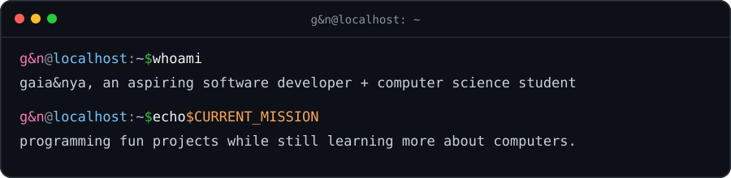

 

##  about me

> `NAME` Feel free to call me Mika. I prefer it that way.  
> `ORIGIN` Online since I was six, and I never really logged off  
> `AFFILIATION` IEEE volunteer  
> `PROJECTS` Small applications built for curiosity and personal use  
> `OFFLINE` Music production · gaming · cosplay · livestreaming

##  toolbox

&nbsp;&nbsp;
&nbsp;&nbsp;
&nbsp;&nbsp;
&nbsp;&nbsp;

  
&nbsp;&nbsp;
&nbsp;&nbsp;
&nbsp;&nbsp;
&nbsp;&nbsp;

  

##  last.fm scrobbles

##  find me online

---

`thanks for stopping by — stranger.`

♪

